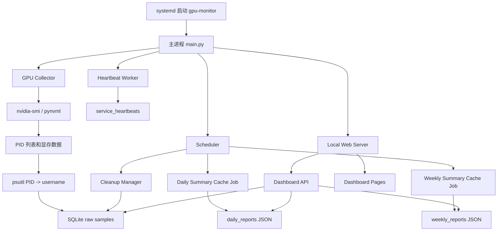
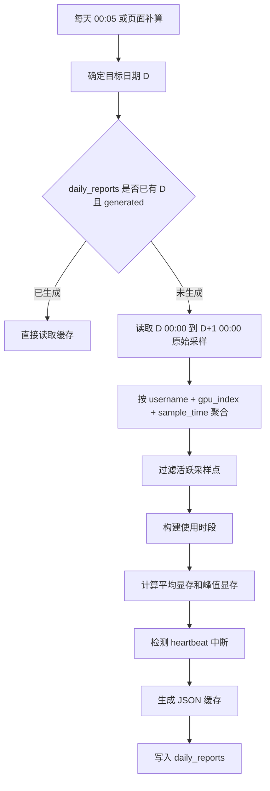
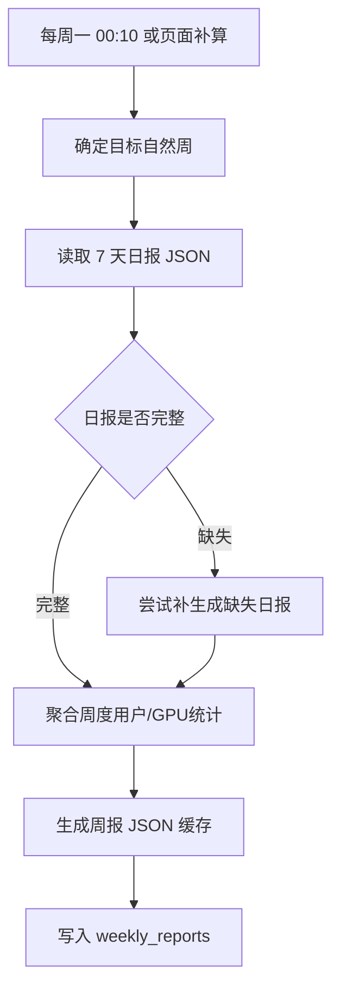

# GPU 服务器使用监控 Dashboard 项目规划报告

> 项目目标：在远程服务器上部署一个 Python 编写的 GPU 使用监控服务，持续采集 GPU 使用情况并写入 SQLite，通过本地 Web Dashboard 实时查看当天状态、历史日报和自然周统计。系统默认监听 `127.0.0.1:8765`，用户可通过服务器本机浏览器或 SSH 端口转发访问。系统需要支持断电/重启后的自动恢复、数据持久化、统计缓存、周期性清理和服务健康检查。

---

## 1. 项目背景与目标

在多人共用 GPU 服务器的场景下，常见问题包括：

- 不清楚当前有哪些用户正在占用 GPU；
- 不清楚当天每个用户用了哪些 GPU 卡；
- 不清楚具体使用时段；
- 不清楚程序平均显存和峰值显存；
- 无法长期追踪资源使用习惯；
- 服务器重启后监控数据容易断裂；
- 手工查看 `nvidia-smi` 不适合做历史统计。

原始方案以日报/周报邮件推送为主，但邮件模式存在明显工程成本：

- 需要配置 QQ SMTP 和授权码；
- 邮件失败需要重试、去重和状态管理；
- 邮件会长期遗留在邮箱中；
- 用户想实时查看当天情况时，不能等到日报或周报生成；
- 邮件正文更适合审计留痕，不适合交互式查看。

因此本项目调整为 **本地 Web Dashboard 优先**：

1. **持续采集** GPU 使用数据；
2. **实时展示** 当前 GPU、用户、进程和显存状态；
3. **按自然日统计**用户、GPU 卡号、使用时段、平均显存、峰值显存；
4. **按自然周聚合** 7 天统计，形成周视图；
5. **支持持久化存储**，避免服务器重启导致当天数据丢失；
6. **支持 systemd 自启动和异常退出重启**；
7. **支持 heartbeat**，识别服务中断区间；
8. **支持统计缓存**，加速历史日报和周报查询；
9. **周期性清理历史数据**，保持存储轻量；
10. **默认只监听 localhost**，降低暴露面。

---

## 2. 已确认需求口径

### 2.1 使用人员归因

使用人员按照 **Linux 用户名** 归因。

实现方式：

```text
GPU 进程 PID
    -> psutil.Process(pid).username()
    -> Linux username
```

若 PID 在采样瞬间已经退出，或当前服务权限不足以读取该 PID 信息，则记录为：

```text
unknown
```

Dashboard 和历史统计中应单独标记 `unknown` 进程，以便后续人工排查。

---

### 2.2 使用时段切片方式

监控服务不应只在 0 点启动，而应作为常驻服务持续采集。

正确方式：

```text
程序启动后立即采集
每条采样数据带 timestamp
日报/周报/实时页面查询时按时间范围切片
```

日报统计区间定义为：

```text
[当天 00:00:00, 次日 00:00:00)
```

例如：

```text
2026-06-07 日报统计区间：
2026-06-07 00:00:00 <= timestamp < 2026-06-08 00:00:00
```

如果程序在当天中途重启，重启后继续采集，不重新定义日期边界。

---

### 2.3 平均显存与峰值显存定义

对于某用户 `U`、某 GPU `G`、某个采样时间点 `t`：

```text
mem(U, G, t) = 用户 U 在 GPU G 上所有进程显存占用之和
```

平均程序显存定义为：

```text
平均程序显存 = 用户在某 GPU 活跃采样点上的显存占用总和 / 活跃采样点数量
```

峰值程序显存定义为：

```text
峰值程序显存 = 用户在某 GPU 任一采样点上的最大显存占用
```

如果同一用户在同一张 GPU 上同时启动多个进程，则在同一采样点先对多个进程显存求和，再参与平均值和峰值计算。

---

### 2.4 采样频率

默认采样频率：

```text
60 秒采样一次
```

需要配置化，允许后续调整：

```yaml
collector:
  sample_interval_seconds: 60
```

说明：

- 60 秒采样适合轻量多人共享 GPU 监控；
- 短于采样间隔的瞬时任务可能无法被记录；
- Dashboard 和历史统计中应注明采样间隔，避免误读统计结果；
- 页面刷新频率默认与采样频率一致。

---

### 2.5 数据持久化

不使用内存作为中间数据的唯一存储。

所有采样数据需要实时写入本地持久化数据库，推荐使用：

```text
SQLite
```

理由：

- 部署简单；
- 无需额外数据库服务；
- 适合单机服务器监控；
- 支持事务；
- 可配合 WAL 模式增强可靠性；
- 足够支撑 60 秒级采样的数据量；
- 便于 Dashboard 直接查询近期历史数据。

---

### 2.6 Dashboard 访问方式

Dashboard 初版只面向本机访问：

```yaml
web:
  host: "127.0.0.1"
  port: 8765
```

本机访问：

```text
http://localhost:8765
```

远程服务器推荐通过 SSH 端口转发访问：

```bash
ssh -L 8765:127.0.0.1:8765 user@server
```

然后在本地浏览器访问：

```text
http://localhost:8765
```

初版不做公网暴露，不做账号登录，不做多用户权限系统。安全边界依赖：

- 服务只监听 `127.0.0.1`；
- SSH 账号权限；
- 服务器文件权限。

---

### 2.7 统计缓存与幂等

Dashboard 需要实时查询当天数据，也需要高效查看历史日报和周报。

推荐策略：

```text
当天视图：直接基于 SQLite 原始采样实时聚合
历史日报：优先读取 daily_reports JSON 缓存，缺失时从原始数据补算
周报视图：优先读取 weekly_reports JSON 缓存，缺失时从 7 天日报缓存聚合
```

日报和周报缓存需要避免重复生成：

```text
daily_reports.report_date UNIQUE
weekly_reports(week_start, week_end) UNIQUE
```

缓存生成失败时记录错误，不影响采集和 Dashboard 当前状态页面。

---

### 2.8 数据清理时机

Dashboard 模式下，不建议在日报生成后立即删除当天原始数据，因为用户可能需要回看最近几天的详细历史。但本项目优先追求轻量存储，因此默认只保留很短的原始数据窗口。

推荐采用固定保留周期：

| 数据 | 推荐保留 |
|---|---:|
| 原始 GPU 进程采样 | 3 天 |
| GPU 设备快照 | 3 天 |
| heartbeat | 7 天 |
| error_events | 7 天 |
| daily JSON 缓存 | 14 天 |
| weekly JSON 缓存 | 12 周 |

清理原则：

- 只清理超过保留周期的数据；
- 清理任务不能影响采集循环；
- 清理前写日志；
- SQLite 清理后可低频执行 `VACUUM`，例如每月一次。

---

### 2.9 周报周期边界

周报按自然周统计。

自然周定义为：

```text
周一 00:00:00 <= timestamp < 下周一 00:00:00
```

例如：

```text
2026-06-01 00:00:00 ~ 2026-06-08 00:00:00
```

周报展示周期：

```text
2026-06-01 ~ 2026-06-07
```

推荐缓存生成时间：

```text
每周一 00:10 生成上一自然周周报缓存
```

---

### 2.10 GPU 卡号口径

GPU 卡号直接按照 `nvidia-smi` 中展示的 GPU index：

```text
0, 1, 2, 3, 4, ...
```

Dashboard 和历史统计中以 GPU index 作为主要展示标识。

为了增强内部数据稳定性，可以可选存储 GPU UUID，但展示口径仍以 `nvidia-smi` index 为准。

---

## 3. 总体功能设计

### 3.1 核心功能

| 功能 | 说明 |
|---|---|
| GPU 采集 | 每 60 秒采集 GPU 进程信息 |
| 用户归因 | 根据 PID 反查 Linux 用户名 |
| 数据持久化 | 将采样数据实时写入 SQLite |
| 实时 Dashboard | 通过 localhost 页面查看当前和当天 GPU 使用情况 |
| 当前状态 API | 提供当前 GPU、用户、进程、显存快照 |
| 日报视图 | 按自然日查看用户、GPU、时段、平均显存、峰值显存 |
| 周报视图 | 按自然周聚合日报统计 |
| 统计缓存 | 生成 daily/weekly JSON 缓存，加速历史查询 |
| 自启动 | systemd 管理服务启动和重启 |
| 中断检测 | 通过 heartbeat 检测服务中断区间 |
| 数据清理 | 按保留周期清理旧数据 |
| 日志记录 | 记录采集、分析、Web、调度、异常日志 |

---

### 3.2 非目标范围

初版不强制支持以下功能：

| 非目标 | 说明 |
|---|---|
| 邮件推送 | Dashboard 模式下不做 QQ SMTP、邮件队列、重试和去重 |
| 公网访问 | 初版只监听 localhost，远程访问通过 SSH 端口转发 |
| 登录认证 | 初版依赖 localhost 和 SSH 权限，不做账号体系 |
| WebSocket 实时推送 | 初版使用前端轮询，降低复杂度 |
| 多服务器集中监控 | 初版面向单台服务器 |
| Slurm 用户归因 | 初版按 Linux 用户名归因 |
| Docker 内真实用户识别 | 初版按宿主机 PID owner 归因 |
| 秒级精准短任务审计 | 60 秒采样无法保证捕获极短任务 |
| GPU index 变更追踪 | Dashboard 按 `nvidia-smi` index 展示 |
| 实时告警 | 初版聚焦实时查看和历史统计，不做主动告警 |

这些功能可以作为后续版本扩展。

---

## 4. 推荐技术选型

| 模块 | 推荐方案 | 说明 |
|---|---|---|
| 开发语言 | Python 3.10+ | 生态成熟，部署简单 |
| GPU 信息采集 | `nvidia-smi` 或 `pynvml` | MVP 可先用 `nvidia-smi` |
| PID 用户解析 | `psutil` | `PID -> Linux username` |
| 本地数据库 | SQLite | 单机轻量持久化 |
| Web 服务 | Python 标准库 `http.server` | 无额外 Web 依赖，符合轻量目标 |
| 页面渲染 | 原生 HTML/CSS/JavaScript | 页面由静态资源和 API 组合渲染 |
| 前端交互 | 原生 JavaScript fetch | 60 秒轮询即可满足实时查看 |
| 调度 | Python 线程内简单调度器 | 无额外调度依赖，执行日报/周报缓存和清理 |
| 后台服务 | systemd | 自启动、异常重启、日志管理 |
| 配置管理 | `config.yaml` + `.env` | 非敏感配置放 yaml，可选环境变量覆盖 |
| 统计缓存格式 | JSON | 便于 Dashboard 和后续程序化分析 |
| 日志 | Python `logging` | 配合 logrotate |
| 测试 | 标准库 `unittest` | 单元测试聚合逻辑、API 和异常场景 |

---

## 5. 系统总体架构

### 5.1 架构概览



---

### 5.2 进程模型

推荐使用一个 Python 主进程，内部包含多个逻辑组件：

```text
Main Process
├── Collector Loop              # 常驻采集
├── Heartbeat Worker            # 定期写入服务心跳
├── Web Server                  # Dashboard 页面和 API
├── Scheduler                   # 负责统计缓存和清理任务
└── Cleanup Manager             # 清理过期数据
```

核心原则：

```text
采集链路优先级最高，不能被 Dashboard 查询、统计缓存或清理任务阻塞。
```

因此：

- Web 查询必须使用短连接/短事务；
- 统计缓存任务失败不能影响采集；
- 清理任务应分批执行，避免长时间锁库；
- SQLite 开启 WAL；
- 所有异常都应被捕获并记录，不能导致采集循环退出。

---

## 6. 推荐项目目录结构

```text
gpu_monitor/
├── pyproject.toml
├── requirements.txt
├── README.md
├── config.yaml
├── .env.example
│
├── gpu_monitor/
│   ├── __init__.py
│   ├── main.py
│   ├── config.py
│   ├── logging_config.py
│   │
│   ├── collector/
│   │   ├── __init__.py
│   │   ├── gpu_collector.py
│   │   ├── nvidia_smi_collector.py
│   │   ├── nvml_collector.py
│   │   ├── process_resolver.py
│   │   └── heartbeat.py
│   │
│   ├── storage/
│   │   ├── __init__.py
│   │   ├── database.py
│   │   ├── schema.sql
│   │   ├── repositories.py
│   │   └── migrations.py
│   │
│   ├── analyzer/
│   │   ├── __init__.py
│   │   ├── daily_analyzer.py
│   │   ├── weekly_analyzer.py
│   │   └── session_builder.py
│   │
│   ├── web/
│   │   ├── __init__.py
│   │   ├── app.py
│   │   ├── api.py
│   │   ├── schemas.py
│   │   ├── views.py
│   │   ├── templates/
│   │   │   ├── base.html
│   │   │   ├── dashboard.html
│   │   │   ├── day.html
│   │   │   └── week.html
│   │   └── static/
│   │       ├── app.js
│   │       └── style.css
│   │
│   ├── reports/
│   │   ├── __init__.py
│   │   ├── daily_report.py
│   │   ├── weekly_report.py
│   │   └── json_cache.py
│   │
│   ├── scheduler/
│   │   ├── __init__.py
│   │   └── jobs.py
│   │
│   ├── cleanup/
│   │   ├── __init__.py
│   │   └── cleanup_manager.py
│   │
│   └── utils/
│       ├── time_utils.py
│       ├── format_utils.py
│       └── lock.py
│
├── scripts/
│   ├── install_systemd.sh
│   ├── init_db.py
│   └── smoke_test_dashboard.py
│
├── systemd/
│   └── gpu-monitor.service
│
├── tests/
│   ├── test_session_builder.py
│   ├── test_daily_analyzer.py
│   ├── test_weekly_analyzer.py
│   ├── test_dashboard_api.py
│   ├── test_cleanup_manager.py
│   └── fixtures/
│
├── data/
│   ├── monitor.db
│   └── reports/
│       ├── daily/
│       └── weekly/
│
└── logs/
    └── gpu-monitor.log
```

---

## 7. 数据采集设计

### 7.1 采集字段

每次采样应尽量记录以下字段：

| 字段 | 说明 |
|---|---|
| `sample_time` | 采样时间 |
| `local_date` | 采样所属本地日期 |
| `gpu_index` | `nvidia-smi` GPU 卡号 |
| `pid` | GPU 进程 PID |
| `username` | Linux 用户名 |
| `process_name` | 进程名 |
| `used_memory_mb` | 该进程占用 GPU 显存 |
| `created_at` | 写入数据库时间 |

可选增强字段：

| 字段 | 说明 |
|---|---|
| `gpu_uuid` | GPU UUID，内部辅助定位 |
| `gpu_name` | GPU 型号 |
| `gpu_total_memory_mb` | GPU 总显存 |
| `gpu_util_percent` | GPU 利用率 |
| `memory_util_percent` | 显存控制器利用率 |
| `cmdline_hash` | 命令行哈希，避免暴露敏感参数 |

默认不在 Dashboard 展示完整命令行参数，避免暴露 token、数据路径和实验参数。

---

### 7.2 采集命令建议

MVP 可以使用 `nvidia-smi`。

获取 GPU index 和 uuid 映射：

```bash
nvidia-smi --query-gpu=index,uuid,name,memory.total,utilization.gpu,utilization.memory --format=csv,noheader,nounits
```

获取 GPU 进程：

```bash
nvidia-smi --query-compute-apps=gpu_uuid,pid,process_name,used_memory --format=csv,noheader,nounits
```

然后通过 GPU UUID 映射回 GPU index。

PID 归因：

```python
import psutil

try:
    username = psutil.Process(pid).username()
except (psutil.NoSuchProcess, psutil.AccessDenied):
    username = "unknown"
```

---

### 7.3 采集循环逻辑

伪代码：

```python
while True:
    start = now()

    try:
        gpu_processes, gpu_snapshots = collector.collect()
        storage.insert_samples(gpu_processes)
        storage.insert_gpu_snapshots(gpu_snapshots)
    except Exception as exc:
        storage.insert_error_event("collector_error", str(exc))
        logger.exception("GPU collection failed")

    elapsed = now() - start
    sleep(max(0, sample_interval - elapsed))
```

注意：

- 采集失败不能导致主进程退出；
- 单次采集时间如果超过采样间隔，需要记录警告；
- 采集时间应使用统一时区；
- 每次写入数据库要尽快提交；
- 空采样也应记录 heartbeat，证明服务仍然存活。

---

## 8. 数据库存储设计

推荐使用 SQLite，并开启 WAL 模式：

```sql
PRAGMA journal_mode=WAL;
PRAGMA synchronous=NORMAL;
PRAGMA foreign_keys=ON;
```

---

### 8.1 原始采样表：`gpu_process_samples`

```sql
CREATE TABLE IF NOT EXISTS gpu_process_samples (
    id INTEGER PRIMARY KEY AUTOINCREMENT,
    sample_time TEXT NOT NULL,
    local_date TEXT NOT NULL,
    gpu_index INTEGER NOT NULL,
    gpu_uuid TEXT,
    pid INTEGER NOT NULL,
    username TEXT NOT NULL,
    process_name TEXT,
    used_memory_mb REAL NOT NULL,
    created_at TEXT NOT NULL
);

CREATE INDEX IF NOT EXISTS idx_samples_date
ON gpu_process_samples(local_date);

CREATE INDEX IF NOT EXISTS idx_samples_user_gpu_time
ON gpu_process_samples(username, gpu_index, sample_time);

CREATE INDEX IF NOT EXISTS idx_samples_time
ON gpu_process_samples(sample_time);
```

说明：

- 一行表示某个采样时间点上某个 GPU 进程；
- 如果同一用户在同一 GPU 上有多个进程，分析阶段按 `sample_time + username + gpu_index` 聚合；
- 如果某次采样没有 GPU 进程，可以不写入该表，但 heartbeat 表仍需写入。

---

### 8.2 GPU 快照表：`gpu_device_snapshots`

```sql
CREATE TABLE IF NOT EXISTS gpu_device_snapshots (
    id INTEGER PRIMARY KEY AUTOINCREMENT,
    sample_time TEXT NOT NULL,
    local_date TEXT NOT NULL,
    gpu_index INTEGER NOT NULL,
    gpu_uuid TEXT,
    gpu_name TEXT,
    total_memory_mb REAL,
    gpu_util_percent REAL,
    memory_util_percent REAL,
    created_at TEXT NOT NULL
);

CREATE INDEX IF NOT EXISTS idx_gpu_snapshot_date
ON gpu_device_snapshots(local_date);

CREATE INDEX IF NOT EXISTS idx_gpu_snapshot_time
ON gpu_device_snapshots(sample_time);
```

该表用于记录 GPU 总体利用率和设备信息，供 Dashboard 当前卡片和历史趋势使用。

---

### 8.3 服务心跳表：`service_heartbeats`

```sql
CREATE TABLE IF NOT EXISTS service_heartbeats (
    id INTEGER PRIMARY KEY AUTOINCREMENT,
    heartbeat_time TEXT NOT NULL,
    status TEXT NOT NULL,
    message TEXT,
    created_at TEXT NOT NULL
);

CREATE INDEX IF NOT EXISTS idx_heartbeat_time
ON service_heartbeats(heartbeat_time);
```

用途：

- 检测服务器断电或服务中断；
- Dashboard 中标记监控不可用区间；
- 区分“无人使用 GPU”和“监控服务没运行”。

---

### 8.4 日报缓存表：`daily_reports`

```sql
CREATE TABLE IF NOT EXISTS daily_reports (
    id INTEGER PRIMARY KEY AUTOINCREMENT,
    report_date TEXT NOT NULL UNIQUE,
    status TEXT NOT NULL,
    generated_at TEXT,
    json_path TEXT,
    content_hash TEXT,
    error_message TEXT,
    created_at TEXT NOT NULL,
    updated_at TEXT NOT NULL
);
```

推荐状态：

```text
pending
generated
failed
```

日报缓存服务于 `/day/{YYYY-MM-DD}` 和周报聚合，不再服务于邮件发送。

---

### 8.5 周报缓存表：`weekly_reports`

```sql
CREATE TABLE IF NOT EXISTS weekly_reports (
    id INTEGER PRIMARY KEY AUTOINCREMENT,
    week_start TEXT NOT NULL,
    week_end TEXT NOT NULL,
    status TEXT NOT NULL,
    generated_at TEXT,
    json_path TEXT,
    content_hash TEXT,
    error_message TEXT,
    created_at TEXT NOT NULL,
    updated_at TEXT NOT NULL,
    UNIQUE(week_start, week_end)
);
```

其中：

```text
week_start = 周一日期
week_end   = 周日日期
```

例如：

```text
week_start = 2026-06-01
week_end   = 2026-06-07
```

---

### 8.6 异常事件表：`error_events`

```sql
CREATE TABLE IF NOT EXISTS error_events (
    id INTEGER PRIMARY KEY AUTOINCREMENT,
    event_time TEXT NOT NULL,
    event_type TEXT NOT NULL,
    severity TEXT NOT NULL,
    message TEXT NOT NULL,
    traceback TEXT,
    created_at TEXT NOT NULL
);

CREATE INDEX IF NOT EXISTS idx_error_events_time
ON error_events(event_time);
```

用途：

- 记录采集异常；
- 记录数据库异常；
- 记录 Web/API 异常；
- 记录统计缓存异常；
- 在 Dashboard 中摘要展示严重异常。

---

## 9. 分析算法设计

### 9.1 活跃使用定义

默认定义：

```text
同一用户在同一 GPU 上的总显存占用 >= 100 MB，则认为该用户在该采样点活跃使用该 GPU。
```

配置项：

```yaml
collector:
  active_memory_threshold_mb: 100
```

---

### 9.2 采样点聚合

原始数据是一行一个进程：

```text
sample_time, username, gpu_index, pid, used_memory_mb
```

分析前需要聚合为一行一个用户-GPU-时间点：

```text
sample_time, username, gpu_index, total_used_memory_mb
```

聚合逻辑：

```sql
SELECT
    sample_time,
    username,
    gpu_index,
    SUM(used_memory_mb) AS total_used_memory_mb
FROM gpu_process_samples
WHERE sample_time >= :range_start
  AND sample_time < :range_end
GROUP BY sample_time, username, gpu_index;
```

然后过滤：

```text
total_used_memory_mb >= active_memory_threshold_mb
```

---

### 9.3 使用时段合并

对于同一用户、同一 GPU，将活跃采样点按时间排序。

默认规则：

```text
相邻活跃采样点间隔 <= session_gap_threshold_seconds，则归为同一使用时段；
相邻活跃采样点间隔 > session_gap_threshold_seconds，则切分为新的使用时段。
```

推荐：

```yaml
session:
  gap_threshold_seconds: 300
```

即 5 分钟。

---

### 9.4 使用时长估计

对于一个使用时段：

```text
start_time = 第一个活跃采样点时间
end_time   = 最后一个活跃采样点时间 + sample_interval
```

需要限制不超过统计边界：

```text
end_time = min(end_time, range_end)
```

使用时长：

```text
duration = end_time - start_time
```

如果只有一个活跃采样点，则使用时长近似为一个采样周期。

---

### 9.5 平均显存和峰值显存

对于同一用户、同一 GPU：

```text
avg_memory_mb = mean(total_used_memory_mb over active samples)
peak_memory_mb = max(total_used_memory_mb over active samples)
```

Dashboard 展示时建议转换为 GB：

```text
memory_gb = memory_mb / 1024
```

保留一位或两位小数。

---

### 9.6 多用户同卡场景

如果多个用户同时使用同一张 GPU，Dashboard 应分别统计每个用户：

```text
GPU 0
├── zhangsan: 09:00 ~ 12:00, 平均 10.2 GB, 峰值 16.8 GB
└── lisi:     10:30 ~ 11:30, 平均  8.1 GB, 峰值 11.4 GB
```

GPU 总体维度可额外展示：

```text
GPU 0 当天被使用时长
GPU 0 当前主要用户
GPU 0 当天峰值显存
GPU 0 当前利用率
```

---

### 9.7 服务中断识别

根据 `service_heartbeats` 检测中断区间。

如果相邻 heartbeat 间隔超过阈值：

```text
heartbeat_gap > heartbeat_missing_threshold_seconds
```

则认为监控中断。

推荐：

```yaml
heartbeat:
  interval_seconds: 60
  missing_threshold_seconds: 300
```

Dashboard 中展示：

```text
监控服务中断区间：
- 2026-06-07 13:21:00 ~ 2026-06-07 13:48:00
```

需要明确：

```text
断电或服务停止期间无法补全真实 GPU 使用数据。
```

---

## 10. Dashboard 设计

### 10.1 访问方式

默认启动后访问：

```text
http://localhost:8765
```

远程服务器访问：

```bash
ssh -L 8765:127.0.0.1:8765 user@server
```

然后在本地浏览器访问：

```text
http://localhost:8765
```

---

### 10.2 页面结构

推荐页面：

| 页面 | 路径 | 说明 |
|---|---|---|
| 今日实时 Dashboard | `/` | 默认页面，展示当前状态和当天累计 |
| 指定日期日报 | `/day/{date}` | 查看某一自然日统计 |
| 指定自然周周报 | `/week/{date}` | 传入周内任意日期，展示该自然周 |
| 健康检查 | `/health` | 展示服务、采集、数据库状态 |

今日实时 Dashboard 推荐内容：

```text
一、顶部状态
- 服务器名称
- 当前时间
- 最近成功采样时间
- 采样间隔
- 监控服务状态

二、当前 GPU 卡片
- GPU index
- GPU 型号
- 总显存
- 当前显存占用
- 当前 GPU 利用率
- 当前使用用户

三、当前用户占用
- 用户名
- GPU 卡号
- 进程数
- 当前显存占用
- 进程名摘要

四、今日累计
- 活跃用户数
- 被使用 GPU 数
- 累计 GPU 使用时长
- 每用户每 GPU 使用时段
- 平均程序显存
- 峰值程序显存

五、异常与说明
- unknown 用户进程
- 最近采集异常
- heartbeat 中断区间
- 短任务采样限制说明
```

---

### 10.3 Dashboard API

推荐 API：

| API | 说明 |
|---|---|
| `GET /api/current` | 返回最新 GPU 使用快照 |
| `GET /api/today` | 返回当天累计统计 |
| `GET /api/day?date=YYYY-MM-DD` | 返回指定日期统计 |
| `GET /api/week?start=YYYY-MM-DD` | 返回指定自然周统计 |
| `GET /api/health` | 返回服务健康状态 |

API 返回 JSON，页面用 `fetch` 轮询刷新。

实时刷新策略：

```text
页面每 refresh_interval_seconds 请求 /api/current 和 /api/today
默认 refresh_interval_seconds = 60
```

初版不使用 WebSocket。

---

### 10.4 当前状态接口示例

`GET /api/current` 推荐返回结构：

```json
{
  "server_name": "server-a",
  "sample_time": "2026-06-07T20:15:30+08:00",
  "collector_status": "ok",
  "gpus": [
    {
      "gpu_index": 0,
      "gpu_name": "NVIDIA RTX 4090",
      "total_memory_mb": 24564,
      "gpu_util_percent": 88,
      "memory_util_percent": 62,
      "processes": [
        {
          "pid": 12345,
          "username": "zhangsan",
          "process_name": "python",
          "used_memory_mb": 18320
        }
      ]
    }
  ],
  "unknown_process_count": 0,
  "last_error": null
}
```

---

## 11. 日报与周报统计缓存

### 11.1 日报缓存生成

推荐每天：

```text
00:05
```

生成前一天日报 JSON 缓存。

例如：

```text
2026-06-08 00:05 生成 2026-06-07 日报缓存
```

日报页面也可以在缓存缺失时即时补算。

日报结构：

```text
GPU 使用日报
日期：YYYY-MM-DD
服务器：server-name
采样间隔：60 秒
统计口径：Linux 用户名归因；显存占用 >= 100 MB 视为活跃使用

一、总览
- 活跃用户数
- 被使用 GPU 数
- 总 GPU 使用时长
- 监控中断次数
- unknown 用户进程数量

二、用户使用详情
用户：username
  GPU 0
    使用时段
    累计使用时长
    平均程序显存
    峰值程序显存

三、GPU 维度摘要
GPU 0
  主要用户
  被使用时长
  峰值程序显存

四、异常与说明
- 监控中断区间
- unknown 用户进程
- 采集异常
```

---

### 11.2 周报缓存生成

推荐：

```text
每周一 00:10
```

生成上一自然周周报 JSON 缓存。

例如：

```text
2026-06-08 00:10 生成 2026-06-01 ~ 2026-06-07 周报缓存
```

周报优先基于 7 份日报 JSON 生成：

```text
reports/daily/*.json
```

如果某天日报 JSON 缺失，系统应尝试：

1. 从数据库中检查该天原始数据是否仍存在；
2. 若存在，则补生成日报缓存；
3. 若不存在，则在周报中标记该日期数据缺失。

周报结构：

```text
GPU 使用周报
周期：YYYY-MM-DD ~ YYYY-MM-DD
服务器：server-name

一、总览
- 本周活跃用户数
- 本周被使用 GPU 数
- 本周累计 GPU 使用时长
- 监控中断次数
- 数据完整性

二、用户维度汇总
用户：username
  使用 GPU
  累计 GPU 使用时长
  日均 GPU 使用时长
  平均程序显存
  周峰值程序显存
  最常使用 GPU

三、GPU 维度汇总
GPU 0
  被使用总时长
  主要用户
  峰值程序显存
  使用天数

四、每日摘要
YYYY-MM-DD
  活跃用户数
  使用 GPU 数
  总 GPU 使用时长

五、异常与说明
- 缺失日报
- 服务中断
- 采集异常
```

---

## 12. 调度设计

### 12.1 常驻任务

| 任务 | 频率 | 说明 |
|---|---:|---|
| GPU 采集 | 每 60 秒 | 采集 GPU 进程数据 |
| 心跳写入 | 每 60 秒 | 标记服务存活 |
| Web Dashboard | 常驻 | 提供页面和 API |
| 清理任务 | 每天 01:00 | 清理超过保留周期的数据 |

---

### 12.2 定时统计任务

| 任务 | 时间 | 目标数据 |
|---|---|---|
| 日报缓存生成 | 每天 00:05 | 前一天 |
| 周报缓存生成 | 每周一 00:10 | 上一自然周 |

---

### 12.3 启动补偿机制

程序启动时需要执行补偿检查，避免服务器在统计缓存生成时间点宕机导致漏生成。

启动后检查：

```text
1. 昨日及更早未生成的日报缓存
2. 上一自然周未生成的周报缓存
3. 最近 heartbeat 是否存在明显中断
```

例如：

```text
服务器周一 00:00 宕机
周一 03:30 恢复
程序启动后应补生成上一日的日报缓存和上一自然周周报缓存
```

补偿机制是保证历史页面完整性的关键。

---

## 13. 数据清理策略

### 13.1 清理对象

| 数据 | 用途 | 推荐清理策略 |
|---|---|---|
| 原始采样数据 | Dashboard 最近几天查询、日报补算 | 保留最近 3 天 |
| GPU 快照数据 | 当前卡片和最近趋势 | 保留最近 3 天 |
| 日报 JSON 缓存 | 近期历史日报、周报聚合 | 保留最近 14 天 |
| 周报 JSON 缓存 | 轻量长期审计 | 保留最近 12 周 |
| error_events | 排查近期异常 | 保留最近 7 天 |
| heartbeat | 检测近期中断 | 保留最近 7 天 |

---

### 13.2 推荐清理流程

每天 01:00 执行：

```text
1. 读取配置中的保留周期
2. 删除超过保留周期的 gpu_process_samples
3. 删除超过保留周期的 gpu_device_snapshots
4. 删除超过保留周期的 service_heartbeats
5. 删除超过保留周期的 error_events
6. 删除超过保留周期的 daily JSON 缓存和 daily_reports 记录
7. 删除超过保留周期的 weekly JSON 缓存和 weekly_reports 记录
8. 写入清理日志
```

要求：

- 分批删除，避免长事务；
- 清理异常写入 `error_events`；
- 清理失败不能影响采集和 Web 服务；
- 不清理当天数据。

---

## 14. 异常处理机制

### 14.1 采集异常

可能原因：

- `nvidia-smi` 不存在；
- NVIDIA 驱动异常；
- GPU 设备不可见；
- 命令超时；
- 输出格式异常。

处理方式：

```text
1. 捕获异常
2. 写入 error_events
3. 写入日志
4. 本轮采样跳过
5. 不退出主进程
6. Dashboard 显示最近错误摘要
7. 下轮继续采样
```

---

### 14.2 PID 归因异常

可能原因：

- PID 在采样后立即退出；
- 服务权限不足；
- 进程状态异常。

处理方式：

```text
1. username 记录为 unknown
2. process_name 尽量保留
3. error_events 记录 AccessDenied/NoSuchProcess
4. Dashboard 汇总 unknown 进程数量
```

---

### 14.3 数据库异常

可能原因：

- SQLite 被锁；
- 磁盘满；
- 数据库文件损坏；
- 权限不足。

处理方式：

```text
1. SQLite 开启 WAL 模式
2. 写入使用短事务
3. 遇到 database locked 时有限重试
4. 遇到磁盘满时写日志并停止清理外的非必要操作
5. 数据库损坏时保留原文件，创建严重异常事件
```

严重数据库异常可能影响采集和 Dashboard，应尽快通过 systemd 日志排查。

---

### 14.4 Web 服务异常

可能原因：

- 端口被占用；
- 模板渲染异常；
- API 查询超时；
- 数据库短暂 locked；
- 用户请求参数非法。

处理方式：

```text
1. 端口占用时启动失败并写 CRITICAL 日志
2. API 参数非法返回 400
3. 查询异常返回 500，并写 error_events
4. 页面渲染异常显示简化错误页
5. Web 请求异常不能导致采集循环退出
```

---

### 14.5 服务中断/服务器重启

处理方式：

```text
1. systemd 自动拉起服务
2. 程序启动后立即采集
3. 启动时执行日报/周报缓存补偿检查
4. heartbeat 检测中断区间
5. Dashboard 中标注监控中断
```

需要明确：

```text
断电期间没有采集进程运行，因此无法补全断电期间真实 GPU 使用数据。
```

---

### 14.6 调度任务重复执行

可能原因：

- 程序重启；
- 调度线程重复触发；
- 手动执行补偿任务；
- 多实例意外启动。

处理方式：

```text
1. daily_reports.report_date 设置 UNIQUE
2. weekly_reports.week_start + week_end 设置 UNIQUE
3. 统计缓存生成前先检查状态
4. 使用文件锁或数据库锁避免多实例并发
```

---

### 14.7 系统时间异常

可能原因：

- NTP 校时；
- 时区配置错误；
- 夏令时变化；
- 手动修改系统时间。

处理方式：

```text
1. config.yaml 中显式配置 timezone
2. 所有日期切片基于配置时区
3. 数据库存储 ISO 时间字符串
4. Dashboard 显示本地时间
5. 若检测到时间倒退，写入 error_events
```

---

## 15. 配置文件设计

### 15.1 `config.yaml` 示例

```yaml
app:
  server_name: "server-a"
  timezone: "Asia/Shanghai"

web:
  enabled: true
  host: "127.0.0.1"
  port: 8765
  refresh_interval_seconds: 60

collector:
  backend: "nvidia-smi"
  sample_interval_seconds: 60
  active_memory_threshold_mb: 100
  command_timeout_seconds: 10

session:
  gap_threshold_seconds: 300

heartbeat:
  interval_seconds: 60
  missing_threshold_seconds: 300

reports:
  cache_dir: "/var/lib/gpu-monitor/reports"
  daily:
    generate_time: "00:05"
  weekly:
    generate_day: "monday"
    generate_time: "00:10"

storage:
  sqlite_path: "/var/lib/gpu-monitor/monitor.db"
  cleanup:
    raw_retention_days: 3
    gpu_snapshot_retention_days: 3
    daily_cache_retention_days: 14
    weekly_cache_retention_weeks: 12
    error_log_retention_days: 7
    heartbeat_retention_days: 7

users:
  alias:
    zhangsan: "张三"
    lisi: "李四"
    unknown: "未知用户"
```

---

### 15.2 `.env.example` 示例

Dashboard MVP 没有必需的敏感配置。

可选保留：

```bash
GPU_MONITOR_CONFIG=/etc/gpu-monitor/config.yaml
```

注意：

```text
.env 不应提交到 Git。
```

---

## 16. systemd 部署设计

### 16.1 服务文件示例

```ini
[Unit]
Description=GPU Usage Monitor Dashboard
After=network-online.target
Wants=network-online.target

[Service]
Type=simple
User=root
WorkingDirectory=/opt/gpu-monitor
EnvironmentFile=-/etc/gpu-monitor/gpu-monitor.env
ExecStart=/opt/gpu-monitor/.venv/bin/python -m gpu_monitor.main --config /etc/gpu-monitor/config.yaml
Restart=always
RestartSec=10
KillSignal=SIGTERM
TimeoutStopSec=30

[Install]
WantedBy=multi-user.target
```

说明：

- `Restart=always` 保证异常退出后自动重启；
- 默认监听 `127.0.0.1:8765`，不直接暴露公网；
- 是否使用 `User=root` 取决于权限需求；
- 如果普通服务用户可以运行 `nvidia-smi` 并读取 PID owner，则可使用普通用户；
- 配置集中放在 `/etc/gpu-monitor/config.yaml`。

---

### 16.2 常用维护命令

```bash
sudo systemctl daemon-reload
sudo systemctl enable gpu-monitor
sudo systemctl start gpu-monitor
sudo systemctl status gpu-monitor
sudo systemctl restart gpu-monitor
sudo journalctl -u gpu-monitor -f
```

端口转发访问：

```bash
ssh -L 8765:127.0.0.1:8765 user@server
```

---

## 17. 报告缓存文件存储设计

推荐目录：

```text
/var/lib/gpu-monitor/reports/
├── daily/
│   └── 2026-06-07.json
└── weekly/
    └── 2026-06-01_2026-06-07.json
```

其中：

- JSON 用于 Dashboard 历史查询；
- 周报优先基于 7 天日报 JSON 聚合；
- Markdown/HTML 不再是 MVP 必需产物；
- 如后续需要导出，可从 JSON 再渲染 Markdown/HTML。

---

## 18. 日报缓存生成流程



---

## 19. 周报缓存生成流程



---

## 20. 启动恢复流程

程序启动时应执行以下动作：

```text
1. 初始化配置；
2. 初始化数据库；
3. 检查是否已有另一个实例运行；
4. 启动采集循环；
5. 启动 heartbeat；
6. 启动 Web Dashboard；
7. 执行日报缓存补偿检查；
8. 执行周报缓存补偿检查；
9. 启动清理调度。
```

补偿逻辑：

```text
如果昨天日报缓存未生成，则立即生成。
如果上一自然周周报缓存未生成，则立即生成。
如果最近 heartbeat 存在缺口，则 Dashboard 标记中断区间。
```

---

## 21. 维护机制

### 21.1 日志维护

建议日志路径：

```text
/var/log/gpu-monitor/gpu-monitor.log
```

日志分级：

| 等级 | 用途 |
|---|---|
| DEBUG | 调试采集和 API 查询细节 |
| INFO | 正常采集、缓存生成、Web 启动 |
| WARNING | 采集超时、unknown 用户、轻微异常 |
| ERROR | 数据库写入失败、API 查询失败 |
| CRITICAL | 数据库损坏、配置错误、服务无法启动 |

建议配合 `logrotate`：

```text
保留 30 天日志
单文件超过 50MB 自动轮转
```

---

### 21.2 数据库维护

推荐维护动作：

```text
1. 定期检查数据库大小；
2. 定期执行清理任务；
3. 周期性备份 monitor.db；
4. SQLite 使用 WAL 模式；
5. 定期 VACUUM，建议低频执行，例如每月一次。
```

---

### 21.3 配置维护

配置项应集中在：

```text
/etc/gpu-monitor/config.yaml
```

如果后续有敏感配置，放在：

```text
/etc/gpu-monitor/gpu-monitor.env
```

并设置权限：

```bash
sudo chmod 600 /etc/gpu-monitor/gpu-monitor.env
```

---

### 21.4 健康检查

建议提供 CLI 命令：

```bash
gpu-monitor status
gpu-monitor test-collector
gpu-monitor serve --host 127.0.0.1 --port 8765
gpu-monitor generate-daily --date 2026-06-07
gpu-monitor generate-weekly --start 2026-06-01
gpu-monitor cleanup
```

同时提供 HTTP 健康检查：

```text
GET /api/health
```

---

## 22. 安全与隐私设计

### 22.1 Dashboard 访问安全

初版安全策略：

```text
1. 默认只监听 127.0.0.1；
2. 不绑定 0.0.0.0；
3. 远程访问通过 SSH 端口转发；
4. 不在公网直接暴露端口；
5. systemd 服务用户只授予必要权限。
```

如果后续需要局域网访问，需要新增：

- 登录认证；
- 反向代理访问控制；
- HTTPS 或内网可信边界；
- 访问日志。

---

### 22.2 用户信息最小化

Dashboard 默认只展示：

```text
Linux 用户名
GPU 卡号
使用时段
平均显存
峰值显存
累计时长
进程名
PID
```

不默认展示：

```text
完整命令行参数
工作目录
脚本路径
环境变量
```

因为这些可能包含敏感信息，例如 token、数据路径、实验名称等。

---

### 22.3 文件权限

建议：

```bash
sudo chown -R gpu-monitor:gpu-monitor /var/lib/gpu-monitor
sudo chmod -R 750 /var/lib/gpu-monitor
sudo chmod 640 /etc/gpu-monitor/config.yaml
```

---

## 23. 测试计划

### 23.1 单元测试

重点测试：

| 测试对象 | 测试内容 |
|---|---|
| `session_builder` | 活跃点合并、gap 切分、跨天边界 |
| `daily_analyzer` | 平均显存、峰值显存、多进程求和 |
| `weekly_analyzer` | 7 天日报聚合、缺失日报处理 |
| `dashboard_api` | current/today/day/week/health 返回结构 |
| `cleanup_manager` | 按保留周期清理，不误删近期数据 |
| `time_utils` | 自然日、自然周、时区切片 |

---

### 23.2 集成测试

重点测试：

```text
1. 模拟 nvidia-smi 输出；
2. 插入多用户、多 GPU、多进程样本；
3. 启动 Dashboard 测试客户端；
4. 验证 /api/current；
5. 验证 /api/today；
6. 验证 /api/day；
7. 验证 /api/week；
8. 验证 heartbeat 中断展示；
9. 验证清理逻辑不误删保留周期内数据。
```

---

### 23.3 服务器实测

上线前应在真实服务器上验证：

```text
1. nvidia-smi 能正常返回 GPU 信息；
2. psutil 能正确解析 Linux 用户名；
3. SQLite 文件有写权限；
4. Dashboard 能监听 127.0.0.1:8765；
5. SSH 端口转发后本地浏览器能访问；
6. systemd 能自动启动；
7. kill 掉进程后 systemd 能自动拉起；
8. 服务器重启后服务自动启动；
9. 今日页面能够实时刷新；
10. 日报和周报页面能够按预期生成统计。
```

---

## 24. 验收标准

### 24.1 采集验收

- 服务启动后立即开始首次采集；
- 每 60 秒写入一次当前 GPU 使用状态；
- 无 GPU 进程时不误报用户使用；
- 多用户同卡时能够分别归因；
- 同一用户多进程时能够合并显存。

---

### 24.2 Dashboard 验收

- 服务启动后可访问 `http://localhost:8765`；
- 首页展示最近成功采样时间；
- 首页展示当前每张 GPU 的状态；
- 首页展示当前活跃用户和进程；
- 页面每 60 秒刷新当前状态；
- 采集异常时页面显示最近错误摘要；
- 无 GPU 使用时页面清楚显示“当前无 GPU 使用”。

---

### 24.3 日报视图验收

- `/day/{date}` 能展示指定日期统计；
- 日报按用户组织；
- 每个用户包含 GPU 卡号、使用时段、累计时长、平均显存、峰值显存；
- 页面包含采样间隔和统计口径；
- 监控中断区间能够被标记；
- 缓存缺失时可从原始数据补算。

---

### 24.4 周报视图验收

- `/week/{date}` 能展示该日期所在自然周统计；
- 周报基于 7 天日报聚合；
- 周报包含用户维度和 GPU 维度统计；
- 缺失日报会在页面中明确标记；
- 缓存缺失时可补生成。

---

### 24.5 重启恢复验收

- 服务器重启后服务自动启动；
- 重启前已写入数据库的数据不丢失；
- 重启后继续采集；
- 启动时能补生成漏掉的日报/周报缓存；
- Dashboard 中能显示监控中断区间。

---

## 25. 实现步骤与里程碑

### 阶段 1：基础采集 MVP

目标：

```text
能够每 60 秒采集 GPU 进程、PID、显存，并解析 Linux 用户名。
```

任务：

1. 初始化项目结构；
2. 实现配置读取；
3. 实现 `nvidia-smi` collector；
4. 实现 `psutil` PID 用户解析；
5. 初始化 SQLite；
6. 将采样数据写入 `gpu_process_samples`；
7. 写入 GPU 快照；
8. 写入 heartbeat；
9. 编写基本日志。

交付物：

```text
可持续采集并写入数据库的后台程序。
```

---

### 阶段 2：Dashboard 基础页面与 API

目标：

```text
能够通过 localhost 页面实时查看当前 GPU 使用情况。
```

任务：

1. 接入标准库本地 Web Server；
2. 实现 `/api/current`；
3. 实现 `/api/health`；
4. 实现首页模板；
5. 实现前端 60 秒轮询刷新；
6. 展示 GPU 当前状态；
7. 展示当前活跃用户和进程；
8. 展示最近采样时间和最近错误。

交付物：

```text
访问 http://localhost:8765 可查看实时 GPU 使用状态。
```

---

### 阶段 3：日报分析与 Dashboard 日视图

目标：

```text
能够基于某一天数据生成统计，并在 Dashboard 中查看。
```

任务：

1. 实现日期切片；
2. 实现同一用户同一 GPU 同一时间点多进程显存求和；
3. 实现活跃采样点过滤；
4. 实现使用时段合并；
5. 计算平均显存、峰值显存、累计时长；
6. 检测 heartbeat 中断；
7. 生成日报 JSON 缓存；
8. 写入 `daily_reports`；
9. 实现 `/api/today` 和 `/api/day`；
10. 实现 `/day/{date}` 页面。

交付物：

```text
Dashboard 可查看当天累计和任意日期日报。
```

---

### 阶段 4：调度、缓存补偿与清理

目标：

```text
自动执行日报缓存、周报缓存、启动补偿和数据清理。
```

任务：

1. 接入简单线程调度器；
2. 每天 00:05 生成前一天日报缓存；
3. 每周一 00:10 生成上一自然周周报缓存；
4. 每天 01:00 执行保留周期清理；
5. 实现启动补偿检查；
6. 避免重复生成缓存。

交付物：

```text
无需人工干预的统计缓存和清理系统。
```

---

### 阶段 5：周报分析与 Dashboard 周视图

目标：

```text
基于 7 天日报生成自然周统计，并在 Dashboard 中查看。
```

任务：

1. 读取 7 天日报 JSON；
2. 聚合用户维度统计；
3. 聚合 GPU 维度统计；
4. 统计数据完整性；
5. 生成周报 JSON 缓存；
6. 写入 `weekly_reports`；
7. 实现 `/api/week`；
8. 实现 `/week/{date}` 页面。

交付物：

```text
Dashboard 可查看上一自然周和历史自然周 GPU 使用统计。
```

---

### 阶段 6：systemd 部署与恢复能力

目标：

```text
服务器重启后自动恢复采集和 Dashboard。
```

任务：

1. 编写 systemd service；
2. 配置开机自启动；
3. 配置日志路径；
4. 测试异常退出自动重启；
5. 测试服务器重启自动恢复；
6. 测试 SSH 端口转发访问；
7. 测试日报/周报缓存补偿生成。

交付物：

```text
生产可运行的本地 Dashboard 服务。
```

---

### 阶段 7：测试、文档和上线

目标：

```text
形成可维护、可验证的稳定项目。
```

任务：

1. 编写单元测试；
2. 编写集成测试；
3. 编写 README；
4. 编写部署文档；
5. 编写运维命令说明；
6. 完成真实服务器试运行；
7. 根据试运行结果调整采样间隔和阈值。

交付物：

```text
可长期运行的 GPU Dashboard 监控系统。
```

---

## 26. 关键边界情况

| 场景 | 处理方式 |
|---|---|
| 当前没有任何 GPU 使用 | Dashboard 显示“当前无 GPU 使用” |
| 当天没有任何 GPU 使用 | 日报视图显示“无 GPU 使用记录” |
| 服务器中途重启 | 重启后继续采集，Dashboard 标注中断区间 |
| 00:05 时服务器未运行 | 启动后补生成日报缓存 |
| 周一 00:10 时服务器未运行 | 启动后补生成周报缓存 |
| PID 已退出 | 用户记录为 `unknown` |
| 同一用户多个进程 | 同一采样点显存求和 |
| 多用户同一 GPU | 分用户分别统计 |
| 采样命令超时 | 本轮采样失败，写异常，下一轮继续 |
| 数据库短暂 locked | 有限重试 |
| Web API 查询失败 | 返回错误并记录 `error_events` |
| Dashboard 端口被占用 | 服务启动失败并写 CRITICAL 日志 |
| 磁盘空间不足 | 记录严重异常，停止非必要写入，等待人工处理 |
| 日报缓存缺失但原始数据存在 | 补生成日报缓存 |
| 日报缓存缺失且原始数据已清理 | 周报中标记该日数据缺失 |
| 短于 60 秒任务 | 可能漏记，Dashboard 中注明采样限制 |

---

## 27. 推荐开发优先级

优先级从高到低：

1. **采集稳定性**
2. **数据持久化**
3. **Dashboard 当前状态页**
4. **Dashboard API**
5. **日报分析准确性**
6. **重启恢复**
7. **周报生成**
8. **清理机制**
9. **页面体验优化**
10. **扩展统计指标**
11. **认证、告警或多服务器支持**

最小可用版本应至少包含：

```text
采集 + SQLite + 当前 Dashboard + systemd
```

日报、周报、清理和更复杂的异常展示可以在 MVP 稳定后继续完善。

---

## 28. 最终推荐架构总结

本项目建议采用：

```text
Python 常驻服务
+ nvidia-smi/pynvml 采集
+ psutil 用户归因
+ SQLite 持久化
+ 标准库本地 Dashboard
+ 线程调度统计缓存
+ JSON 日报/周报缓存
+ systemd 自启动与异常重启
+ heartbeat 中断识别
```

核心设计原则：

```text
1. 采集持续运行，不依赖 0 点启动；
2. 数据按 timestamp 入库，聚合时按日期或周范围切片；
3. 用户按照 Linux username 归因；
4. 同一用户同一 GPU 同一采样点多进程显存求和；
5. 平均显存只基于活跃采样点计算；
6. 峰值显存取活跃采样点最大值；
7. Dashboard 默认只监听 127.0.0.1；
8. 页面通过 fetch 轮询刷新，不引入 WebSocket；
9. 日报/周报作为 JSON 缓存服务于历史查询；
10. 原始数据按保留周期清理，不因日报生成立即清理；
11. systemd 负责开机自启和异常恢复；
12. heartbeat 用于识别服务中断；
13. 启动补偿机制用于修复统计缓存缺失。
```

---

## 29. 结论

将项目从邮件模式改为本地 Dashboard 模式是更适合当前需求的方向。

新的最关键闭环是：

```text
实时采集
    -> SQLite 持久化
    -> Dashboard 实时查询
    -> 今日状态展示
    -> 自然日统计缓存
    -> 自然周统计缓存
    -> 历史页面查询
    -> 周期性清理
    -> systemd + heartbeat 保证重启恢复和中断可追踪
```

这个方案相比邮件模式的优势：

- 不需要 QQ SMTP 授权码；
- 不需要邮件失败重试；
- 不需要邮件发送去重；
- 不会产生大量邮件遗存；
- 可以随时查看当天情况；
- 可以通过 SSH 端口转发安全访问；
- MVP 更轻，核心采集和展示价值更早交付。

只要严格实现以下几个点，项目就具备较强可靠性：

- 原始采样数据实时落盘；
- Dashboard 查询和采集循环解耦；
- Web 服务默认只监听 localhost；
- 日报/周报缓存有唯一约束；
- 程序启动时有补偿检查；
- 清理动作只按保留周期执行；
- 所有异常进入日志和数据库事件表；
- systemd 负责开机自启和异常拉起。

后续如果需要主动通知，可以再将邮件、企业微信、飞书或 Slack 作为可选告警插件加入，而不是作为 MVP 主线。
